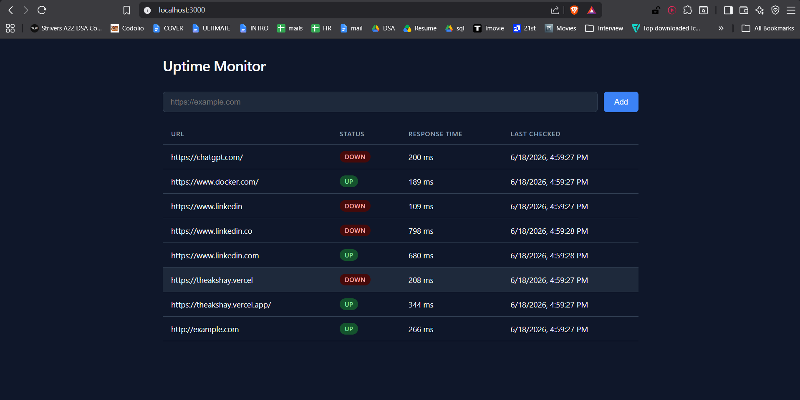
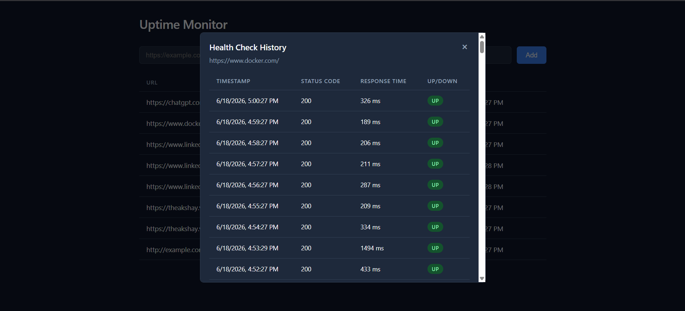
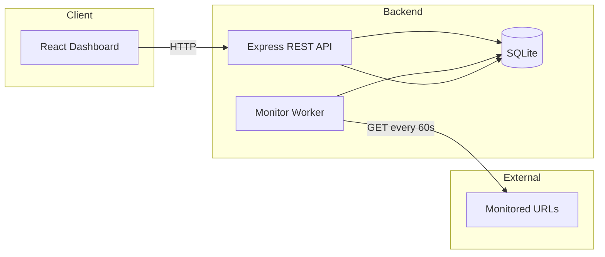
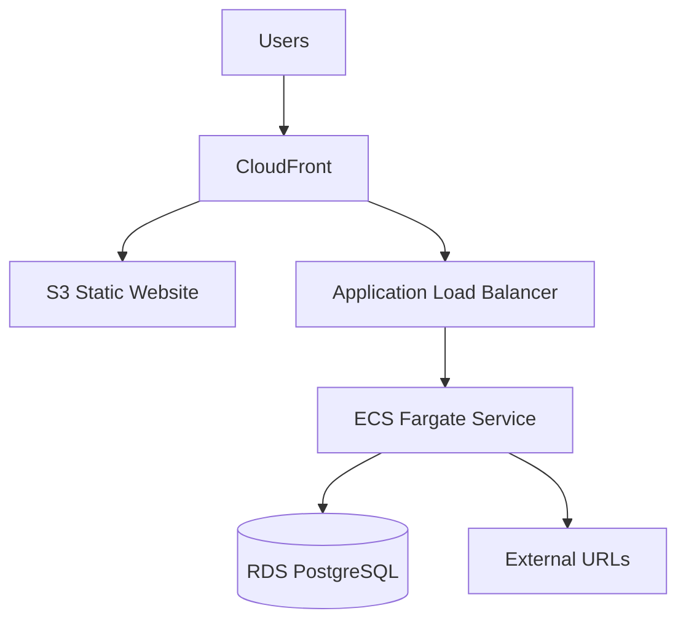

# Uptime Monitor

A full-stack web application for monitoring HTTP/HTTPS endpoint availability. Add URLs through a dashboard, receive periodic health checks, and review status history over time.

## Project Overview

Uptime Monitor lets operators track whether external sites and APIs are reachable. The backend runs scheduled health checks against registered URLs, persists results, and exposes a REST API. The frontend provides a dashboard to add URLs, view current status (UP/DOWN), response times, and per-URL check history.

## Screenshots

### Monitoring Dashboard

Displays all monitored URLs with their latest status, response time, and last check timestamp.



### Health Check History

Clicking a URL displays the complete health check history including timestamps, status codes, response times, and UP/DOWN status.



**Core capabilities**

- Register and validate `http`/`https` URLs
- Automatic health checks every 60 seconds
- Status derived from HTTP response codes (UP: 2xx–3xx; DOWN: errors or other codes)
- Health check history with timestamps, status codes, and response times
- Docker-based deployment for local and containerized environments
- Click any monitored URL to view historical health check records
- Persistent SQLite storage across Docker container restarts

## Architecture



| Layer | Responsibility |
|-------|----------------|
| **Frontend** | URL management UI, status display, history modal, auto-refresh every 15s |
| **REST API** | CRUD for monitored URLs and health check history |
| **Monitor Worker** | Background scheduler; runs checks in parallel with a 5s timeout per URL |
| **Database** | SQLite storage for monitored URLs and health check records |

**API endpoints**

| Method | Path | Description |
|--------|------|-------------|
| `GET` | `/health` | Service health probe |
| `GET` | `/urls` | List monitored URLs with latest check |
| `POST` | `/urls` | Add a URL (`{ "url": "https://..." }`) |
| `GET` | `/urls/:id/history` | Health check history for a URL |

## Tech Stack

| Component | Technologies |
|-----------|--------------|
| **Frontend** | React 19, TypeScript, Vite, Nginx (production container) |
| **Backend** | Node.js 22, Express, TypeScript, better-sqlite3 |
| **Infrastructure** | Docker, Docker Compose |
| **Database** | SQLite (local / Docker); PostgreSQL recommended for production |

## Local Development

**Prerequisites:** Node.js 22+, npm

### 1. Install dependencies

```bash
cd backend && npm install
cd ../frontend && npm install
```

### 2. Start the backend

```bash
cd backend
npm run dev
```

Runs on **http://localhost:3001** with hot reload via `tsx`.

### 3. Start the frontend

In a second terminal:

```bash
cd frontend
npm run dev
```

Runs on **http://localhost:5173**. The frontend reads `VITE_API_URL` from `.env.development` (`http://localhost:3001`).

### 4. Open the app

Visit **http://localhost:5173**, add URLs, and wait for the first monitoring cycle (up to 60 seconds) for status to appear.

## Docker Setup

**Prerequisites:** [Docker Desktop](https://www.docker.com/products/docker-desktop/) (includes Docker Compose v2)

From the project root:

```bash
docker compose up --build
```

| Service | URL | Notes |
|---------|-----|-------|
| Frontend | http://localhost:3000 | Static build served by Nginx |
| Backend | http://localhost:4000 | API and monitor worker |

SQLite data is persisted in the `sqlite-data` Docker volume. Stop services with `Ctrl+C` or `docker compose down`.

## Testing Steps

There is no automated test suite. Verify behavior manually as follows.

### 1. Start the application

Use either local development or Docker (see above).

### 2. Confirm the backend is healthy

```bash
curl http://localhost:3001/health   # local dev
# or
curl http://localhost:4000/health   # Docker
```

Expected: `{ "status": "ok" }`

### 3. Add test URLs via the UI

Open the dashboard and add:

| Label | URL |
|-------|-----|
| Working URL | `https://example.com` |
| Broken URL | `https://this-domain-does-not-exist-12345.com` |

### 4. Wait for a monitoring cycle

The worker runs immediately on startup, then every **60 seconds**. The UI refreshes every **15 seconds**.

### Expected Results

| URL | Expected Status | Notes |
|-----|-----------------|-------|
| `https://example.com` | **UP** | Valid HTTP response (2xx) |
| `https://this-domain-does-not-exist-12345.com` | **DOWN** | DNS/network failure or timeout (5s) |

### 5. Verify history

Click a URL row in the dashboard. Confirm the history modal shows timestamps, status codes, response times, and UP/DOWN badges.

### 6. API verification (optional)

```bash
# List URLs
curl http://localhost:4000/urls

# Add a URL
curl -X POST http://localhost:4000/urls \
  -H "Content-Type: application/json" \
  -d '{"url":"https://example.com"}'

# View history (replace 1 with the URL id)
curl http://localhost:4000/urls/1/history
```

## Deployment Sketch (AWS)

A production deployment separates static frontend hosting from the stateful backend and database.



| Component | AWS Service | Role |
|-----------|-------------|------|
| **Frontend** | **S3** + **CloudFront** | Host the Vite production build; CloudFront provides HTTPS, caching, and a custom domain |
| **Backend** | **ECS Fargate** | Run the Node.js API and monitor worker as a long-lived service behind an ALB |
| **Storage** | **RDS PostgreSQL** or **EFS** | **RDS (recommended):** migrate from SQLite for durable, scalable relational storage. **EFS:** mount shared storage if retaining SQLite with minimal schema changes |
| **Networking** | VPC, ALB, Security Groups | Public ALB for API traffic; private subnets for ECS tasks and RDS |
| **Secrets & config** | Parameter Store / Secrets Manager | Database credentials, `PORT`, and environment-specific settings |

**Build notes**

- Build the frontend with `VITE_API_URL` pointing to the public API domain (e.g. `https://api.example.com`).
- Containerize the backend using the existing `backend/Dockerfile`; configure ECS task definitions with environment variables and RDS connectivity.
- Run a single ECS service that includes both the API and the background monitor worker (as in the current architecture), or split into separate services if scaling requirements differ.
